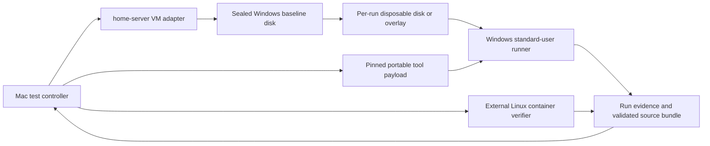

# Windows no-admin test harness plan

Status: implemented foundation; live 8 GB release and 4 GB stress lanes verified

## Live implementation evidence

The implemented harness has now completed these disposable standard-user runs
against Windows build 26200:

- an 8 GB bootstrap smoke run;
- an 8 GB job workflow through native validation and external container runtime
  verification;
- an 8 GB dashboard workflow through native validation, external container
  runtime verification, controller health polling, and browser review;
- a 4 GB bootstrap smoke run reporting 4,289,994,752 guest bytes.

Each completed run was stopped and deleted by the registered adapter. The
sealed 8 GB baseline and the pre-existing 16 GB diagnostic VM remained
separate. These results prove the architecture and both memory profiles, but
they do not yet satisfy the 20-consecutive-run reliability criterion below.

## Decision summary

Build the primary Windows harness around a **fresh standard-user profile with no
developer tools and no administrator access**. The host-side controller may use
administrator privileges to create, start, stop, and discard VMs, but the agent
and citizen workflow must run only as the standard user.

Do not make Docker Desktop, WSL, WinGet, GitHub authentication, or a permanent
machine installation part of the baseline. Bootstrap `uv`, Python, and portable
Git inside the user's profile, run the application through native Windows
validation, and send the exact validated revision to an external Linux
container verifier.

This gives us the environment we actually need to support: a locked-down
corporate Windows machine where the user can write to their own profile but
cannot approve UAC prompts or enable Windows features.

## Why the current VM is not enough

The first three Windows rehearsals proved the application workflow but not the
fresh-machine experience:

- the durable VM was modified between runs;
- Git, WSL, Docker Desktop, and supporting Windows features were installed with
  administrator access;
- Docker Desktop depended on an interactive session and its credential helper
  failed during public pulls over SSH;
- an in-guest restart after enabling Hyper-V/WSL repeatedly hung at the UEFI
  boot-manager screen;
- the VM scripts could start the VM, but `status` and `off` did not wrap Compose
  in the Windows stack's SOPS environment;
- run artifacts, tool caches, images, and earlier profiles remained on the VM.

The current disk is useful diagnostic evidence, but it should not become the
clean baseline.

## Confirmed platform constraints

- A normal first-time WSL installation enables Windows features from an
  administrator PowerShell session and requires a restart. We cannot assume
  this is possible on a fresh no-admin machine. See
  [Microsoft's WSL installation guide](https://learn.microsoft.com/en-us/windows/wsl/install).
- Docker Desktop now has a per-user installation mode, but it uses the WSL 2
  backend, and enabling WSL 2 for the first time still requires elevation.
  Docker is therefore an optional capability when IT has already prepared the
  machine, not a baseline requirement. See
  [Docker Desktop's Windows permission requirements](https://docs.docker.com/desktop/setup/install/windows-permission-requirements/).
- `uv` has a standalone Windows installer and can download and manage Python
  without a preinstalled system Python. Its install and data paths can be kept
  under the current user's profile. See the
  [uv installation](https://docs.astral.sh/uv/getting-started/installation/)
  and [managed Python](https://docs.astral.sh/uv/guides/install-python/)
  documentation.
- Git for Windows publishes a portable edition, so the harness does not need a
  machine-wide Git installation. See the
  [official Windows downloads](https://git-scm.com/install/windows).

## Scope

### Goals

- Start every scenario from the same sealed Windows baseline.
- Run the product as a standard user and prove that the token is not elevated.
- Begin with no `uv`, Python, Git, `gh`, Docker, WSL dependency, or project
  workspace visible to the test user.
- Bootstrap all required native tools without UAC, permanent PATH changes, or
  writes outside the user's profile.
- Exercise dashboard, job, revision, resume, encoding, and failure paths.
- Show dashboard previews in a controller-owned browser.
- Preserve the container quality gate without requiring Docker in the guest.
- Produce a deterministic evidence bundle for every run.
- Make cleanup safe: only a run-owned disposable disk may be deleted
  automatically; the sealed baseline is never a cleanup target.

### Non-goals

- Installing WSL, Hyper-V, Windows containers, or system services during a
  standard-user test.
- Treating a preconfigured developer workstation as evidence for the no-admin
  lane.
- Logging a test user into GitHub or a corporate provider for the default run.
- Weakening validation or silently setting `container.required=false`.
- Rebuilding Windows from the ISO for every scenario once snapshot isolation is
  proven.
- Running multiple Windows guests in parallel on the current home server.

## Proposed architecture



The controller owns lifecycle and evidence. The guest owns application
execution. The external builder owns image construction and runtime smoke
checks. These boundaries must remain explicit in code and state.

## Fresh-machine model

"Fresh" should mean a new disposable disk derived from a sealed baseline, not
a best-effort cleanup of a long-lived profile.

The baseline should contain only:

- a patched Windows 11 installation;
- the hypervisor drivers required by the existing VM implementation;
- the transport needed by the controller, currently OpenSSH Server;
- one controller-only administrative account;
- one standard test account with a prepared but clean profile and SSH key;
- no developer tools, project source, provider credentials, tool caches, or
  Docker/WSL installation.

OpenSSH is test infrastructure, not a capability granted to the application
workflow. The controller may connect through it, but every product command must
execute under the standard account.

Before sealing the baseline, record:

- Windows edition, build, patch level, and locale;
- baseline disk hash and creation date;
- installed optional features and packages;
- test-user group memberships;
- files intentionally present in the test profile.

The first implementation spike must compare two isolation strategies:

1. a complete sparse copy of the baseline disk for each run, which is simpler
   and easier to verify; and
2. a QEMU copy-on-write overlay, only if the current dockur/QEMU integration can
   use it without editing the sealed backing disk.

Start sequentially with complete copies if overlay support is uncertain.
Correct isolation matters more than startup speed.

The golden-path guest uses **8 GB RAM and 4 vCPU**. A separate **4 GB stress
profile** is available and has passed a fresh standard-user bootstrap smoke run.
It is not the default because constrained-memory behavior should remain visible
instead of becoming an unlabelled property of every release rehearsal.

## Standard-user bootstrap

The controller should stage a versioned bootstrap payload into a run-owned
folder such as:

```text
%LOCALAPPDATA%\CitizenHarness\runs\<run-id>\
```

The payload contains or downloads pinned, checksum-verified versions of:

- the standalone `uv.exe`;
- a uv-managed Python 3.11 runtime;
- portable Git for Windows;
- a Git bundle containing the exact template revision;
- the scenario definition and runner scripts.

The bootstrap must:

- modify PATH for the current process only;
- set uv cache, Python install, and workspace paths inside the run directory;
- avoid WinGet because package scope and elevation behavior vary by package;
- avoid permanent execution-policy, registry, shell-profile, and file-association
  changes;
- use `repo_provider=local` by default;
- record every downloaded artifact's URL, version, and SHA-256 digest;
- fail plainly when TLS, proxy, or network policy prevents a download.

Support two bootstrap modes:

1. **Staged mode** — the controller supplies pinned tool archives. This isolates
   workflow compatibility from internet, proxy, and vendor availability.
2. **Network mode** — the standard user downloads from approved public URLs.
   This separately tests proxy, TLS, and egress behavior.

Staged mode is the deterministic release gate. Network mode is a diagnostic
matrix entry.

## No-admin capability lanes

### Required lane: native Windows standard user

This is the release-blocking lane. It must not depend on WSL or Docker.

It covers:

- preflight and local scaffold;
- type selection, interview, and plan approval;
- application build and application-specific tests;
- dashboard AppTest and browser-visible preview, or job dry run;
- revision fingerprints, rewinds, and resume from a new session;
- full lint, format, type, test, and render validation;
- deterministic export of the validated source revision.

### Optional lane: standard user on an IT-prepared Docker machine

This lane may run only when WSL 2 and Docker Desktop were already installed and
enabled by an administrator. It is useful compatibility evidence, but it does
not replace the required lane.

The harness must record that the prerequisite came from the baseline and must
not claim the workflow installed or enabled it without administrator access.

### Separate lane: administrator installation rehearsal

Keep one slow infrastructure scenario that proves a documented administrator
can prepare WSL/Docker when desired. It is not part of citizen acceptance and
should not run for every application scenario.

## External container verification

The standard-user lane must not escape the container gate by setting
`container.required=false`.

Instead, add a state command such as:

```text
record-container-verification \
  --project-fingerprint <sha256> \
  --dockerfile-fingerprint <sha256> \
  --image-id <sha256:...> \
  --evidence <path>
```

The controller should:

1. receive a Git bundle or archive of the exact Windows-validated revision;
2. verify its project fingerprint;
3. build the image on an approved Mac or dedicated Linux builder;
4. run a dashboard health check or job exit-code/output smoke test;
5. write machine-readable evidence containing the builder identity, image ID,
   fingerprints, commands, timestamps, and results;
6. return that evidence to the Windows workflow for recording.

The state machine must reject evidence for a different project or Dockerfile
fingerprint. A later source change must invalidate both Windows validation and
external container evidence.

## Preview access

The controller, not the guest agent, should own browser review.

For dashboard scenarios:

- reserve one fixed guest port for sequential runs initially;
- expose that port through the Windows VM container;
- start Streamlit as the standard user;
- verify the health endpoint from both the guest and controller;
- capture a screenshot and exercise acceptance-critical controls;
- store the screenshot and structured AppTest results in the evidence bundle.

The existing VM currently exposes console, RDP, and SSH only. The VM adapter
will need a preview-port contract. Avoid dynamic port discovery until the
sequential harness is stable.

## Scenario matrix

Implement these scenarios in order:

| Scenario | Purpose | Required outcome |
|---|---|---|
| `bootstrap-smoke` | Prove the user is standard and the machine starts without developer tools | Portable bootstrap succeeds without UAC or permanent machine changes |
| `dashboard-happy` | Exercise UI generation and preview | Plan, build, AppTest, browser preview, validation, and external image smoke pass |
| `job-happy` | Exercise one-shot execution and exit behavior | Dry run, tests, validation, and external container exit 0 pass |
| `revision-stress` | Exercise fingerprints and rewinds | Stale plan/build/preview evidence is rejected and recovery succeeds |
| `encoding-paths` | Reproduce Windows-specific failures | Non-ASCII text and a workspace path containing spaces survive every stage |
| `resume` | Prove persistence without shell state | Fresh PowerShell/SSH sessions resume at each important gate |
| `network-denied` | Check failure quality | Bootstrap or dependency failure is actionable and does not corrupt state |
| `missing-browser` | Check capability handling | Automated render evidence is distinguished from citizen-visible approval |

Run PowerShell 5.1 with the normal en-US Windows encoding as the primary shell.
Add PowerShell 7 and the Windows UTF-8 system locale later as compatibility
entries; they must not mask defects in the default environment.

## Evidence contract

Each run should create an ignored controller-side folder:

```text
.test-runs/<run-id>/
  run.json
  environment.json
  commands.jsonl
  state-transitions.jsonl
  stdout/
  stderr/
  validation/
  preview/
  source.bundle
  container-verification.json
  summary.md
```

Required evidence includes:

- baseline hash and VM adapter revision;
- Windows build, locale, code page, username, and group memberships;
- explicit proof that the product user is not elevated;
- initial and post-bootstrap tool inventory;
- exact template commit and portable-tool digests;
- every state transition and expected negative-test result;
- validation evidence and application-specific test names;
- preview screenshot or explicit browser-capability failure;
- validated source and Dockerfile fingerprints;
- external image ID and runtime result;
- final cleanup result.

Do not store passwords, private keys, provider tokens, Docker credential files,
or decrypted SOPS values in the evidence bundle.

## Ownership boundaries

### This repository

The citizen-template repository should own:

- scenario definitions and expected outcomes;
- the standard-user bootstrap and guest runner;
- Windows-safe state input and evidence commands;
- UTF-8 fixes and Windows regression tests;
- external container-evidence validation;
- evidence schemas and aggregation.

Proposed structure:

```text
tools/windows-harness/
  bootstrap.ps1
  run-scenario.ps1
  collect.py
  schemas/
  scenarios/
```

### Home-server repository

The home-server repository should own:

- baseline creation and sealing;
- disposable disk/overlay creation;
- VM instance names, storage, memory, and port allocation;
- standard-user execution transport;
- start, readiness, stop, evidence retrieval, and run-disk deletion;
- fixes to the existing SOPS handling in `scripts/vm.sh`.

Mutable disks and test-run data must remain outside `~/home-server` and be
documented in `docs/services.md`.

Define a narrow adapter instead of teaching this repository about home-server
internals:

```text
vm-test create --run-id ... --baseline ...
vm-test wait --run-id ...
vm-test exec --run-id ... --user standard -- <command>
vm-test copy-in --run-id ... <source> <destination>
vm-test copy-out --run-id ... <source> <destination>
vm-test stop --run-id ...
vm-test destroy-run --run-id ...
```

`destroy-run` must validate that its target is a registered run-owned disk and
must refuse the baseline path.

## Implementation phases

### Phase 0 — prove isolation and transport

- Create a separate fresh baseline; do not overwrite the current diagnostic
  VM disk.
- Create the standard user and prove non-elevated remote execution.
- Compare full disk copies with copy-on-write overlays.
- Boot, write a sentinel, discard the run, boot again, and prove the sentinel
  is absent.
- Expose one fixed dashboard preview port.

Exit criterion: five consecutive create/run/collect/destroy cycles leave the
baseline unchanged and require no console interaction.

### Phase 1 — portable bootstrap

- Pin and checksum uv and portable Git.
- Install uv-managed Python entirely under the run directory.
- Clone the exact template from a staged Git bundle.
- Record the initial and final tool inventories.
- Exercise staged and network bootstrap modes.

Exit criterion: a standard user reaches the scaffold stage from an empty PATH
without UAC, WinGet, or permanent machine changes.

### Phase 2 — make the workflow Windows-native

- Make all text boundaries explicitly UTF-8.
- Add file/stdin-based structured state input.
- Replace Bash-only required commands with Python helpers or tested PowerShell
  equivalents.
- Require current lint, format, type, and application-test evidence before
  `record-build` advances.
- Expand preview evidence to cover acceptance-critical controls and metrics.

Exit criterion: dashboard, job, and revision scenarios pass native validation
without a run-local source patch or command-quoting workaround.

### Phase 3 — external container verifier

- Define the fingerprinted evidence schema and state command.
- Implement builder and runtime-smoke adapters.
- Test stale, forged, failed, and wrong-revision evidence.

Exit criterion: both application types complete their container gate while the
Windows guest has no Docker or WSL dependency.

### Phase 4 — repeatability and reporting

- Add the full scenario matrix.
- Aggregate failures across runs.
- Add baseline/tool version rotation and evidence retention rules.
- Run at least 20 sequential fresh-machine rehearsals.

Exit criterion: 20 consecutive runs leave no cross-run state and produce a
complete comparable evidence bundle.

### Phase 5 — optimize only after correctness

- Keep the verified 4 GB constrained-memory profile as an explicit matrix lane.
- Consider parallel instances with isolated ports and storage.
- Add automatic baseline patching and resealing with review.

Parallelism is optional. The current host should start with one Windows guest
at a time.

## Definition of done

The no-admin Windows harness is ready when:

- a sealed baseline can produce a disposable run without manual UI work;
- the product identity is a standard user and never receives an elevation
  prompt;
- uv, Python, and Git bootstrap under the user profile from pinned artifacts;
- dashboard, job, revision, encoding/path, and resume scenarios pass;
- a controller browser can review the real dashboard;
- full native validation passes without Windows-specific patches;
- external container evidence is bound to the exact validated revision and the
  image passes its runtime smoke check;
- a new run proves that previous files, tools, caches, and state are absent;
- cleanup cannot target the baseline or unrelated VM data;
- no secrets appear in logs or evidence;
- at least 20 sequential runs complete without harness intervention.

## Immediate next decisions

The first implementation resolves the original decisions as follows:

1. full sparse disk copies are used before considering overlays;
2. the Mac is the first external container builder;
3. Tailscale port 8501 carries the sequential dashboard preview;
4. run evidence is retained under ignored `.test-runs/<run-id>/` directories
   until a maintainer removes it;
5. staged offline mode is the deterministic lane, with network-denied and
   network bootstrap scenarios kept separate;
6. 8 GB and 4 vCPU are the golden-path resources, with an explicit 4 GB stress
   profile available from the controller and verified on Windows build 26200.

The current diagnostic disk remains separate and untouched. Continue Phase 0
reset cycles and the scenario matrix until the repeatability exit criteria are
met; do not treat the implemented foundation as the 20-run reliability proof.
